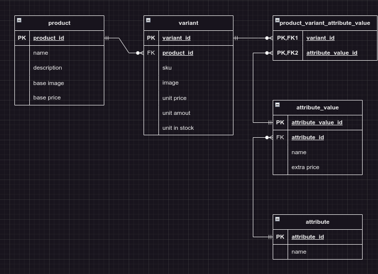

# Odoo Product Variant

Practice design database: Odoo ecommerce product variants and attributes

## Preview

    
View use Draw.io

## Description

description:

- an attribute can have multiple values
- a product can have multiple variants
- a product can be sold with different unit quantities, with different images, with different prices, with different stock quantities
- a variant can combine multiple attributes and values (each with a separate extra price)

mô tả:

- một attribute có nhiều values
- một product có nhiều variants
- một product có thể bán với số lượng unit khác nhau, với image khác nhau, với giá khác nhau, với số lượng tồn kho khác nhau
- một variant có thể kết hợp nhiều thuộc tính và giá trị (với extra price riêng biệt)

## Design

- product
  - (PK) product_id
  - name
  - description
  - base image
  - base price
- variant
  - (PK) variant_id
  - (FK) product_id
  - sku
  - image
  - unit price
  - unit amount
  - unit in stock
- product_variant_attribute_value
  - (PK,FK1) variant_id
  - (PK,FK2) attribute_value_id
- attribute_value
  - (PK) attribute_value_id
  - (FK) attribute_id
  - name
  - extra price
- attribute
  - (PK) attribute_id
  - name
