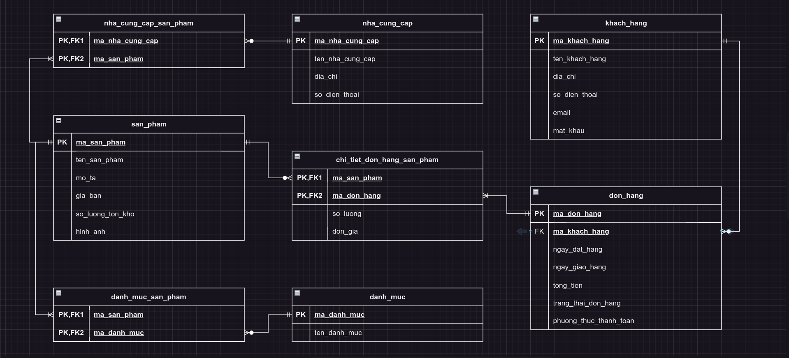
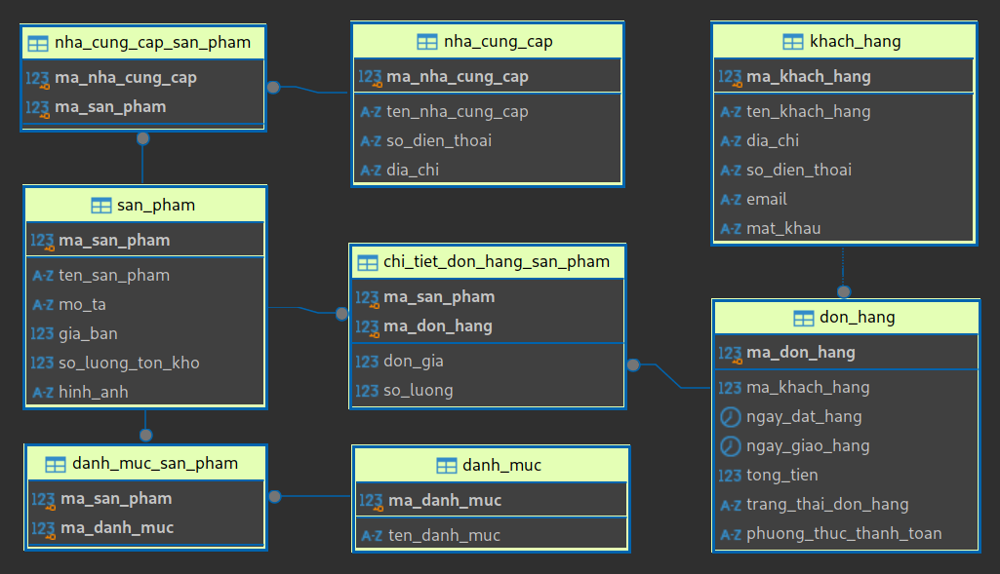

# Design ERD Level 1

## System Objectives

- Manage information about products, customers, and orders.
- Support online sales activities such as adding products, managing inventory, processing orders, and payments.
- Provide statistical reports on sales, customers, and products.

## Main Entities and Attributes

**Product**:

- Product ID
- Product Name
- Description
- Sale Price
- Stock Quantity
- Image

**Customer**:

- Customer ID
- Customer Name
- Address
- Phone Number
- Email
- Password

**Order**:

- Order ID
- Order Date
- Delivery Date
- Total Amount
- Order Status (Processing, Delivered, Canceled)
- Payment Method

**Order Details**:

- Order ID
- Quantity
- Unit Price

**Product Category**:

- Category ID
- Category Name

**Supplier**:

- Supplier ID
- Supplier Name
- Address
- Phone Number

## Relationships

- A customer can place multiple orders.
- An order can contain multiple products.
- A product can belong to multiple categories.
- A product can be supplied by multiple suppliers.

## Business Rules to Consider

- A product must belong to at least one category.
- An order must contain at least one product.
- Order status can only change according to a defined process.

## Solutions

### ERD

    
View

### [Create Database Script](create_database.sql)

### Result Database Relationship - MySQL

    
View

## Example Queries
