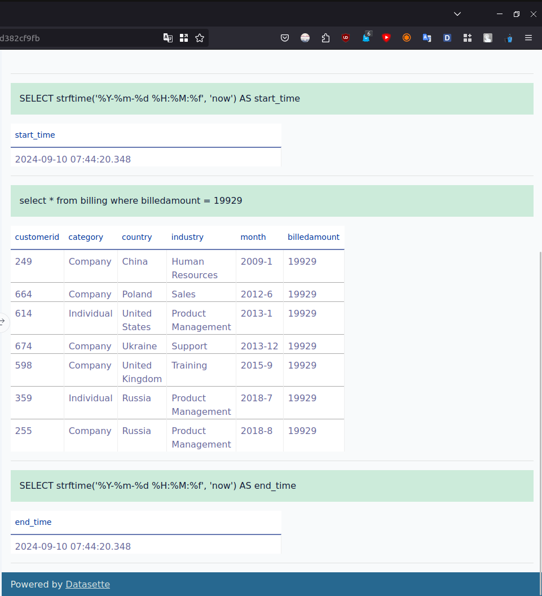

# [Final Task](https://www.coursera.org/learn/relational-database-administration/home/module/5) Solutions

    
Lab: Final Assignment - Database Administration - Part 1 - PostgreSQL

task 1.1 - max-connections

task 1.2 - create-user

task 1.3 - create-role

task 1.4 - grant-privs-to-role

task 1.5 - grant-role

task 1.6 - backup-database

    
Lab: Final Assignment - Database Administration - Part 2 - MySQL

task 2.2.1 - database-restore

task 2.2.2 - table-data-size

task 2.3.1 - query-base-line-mysql

task 2.3.2 - index-creation-mysql

task 2.3.3 - query-indexed

task 2.4.1 - storage-engines

task 2.4.2 - storage-engine-type

task 2.5.1 - bash-script

    
Lab: Final Assignment - Database Administration - Part 3 - DataSette

task 3.1 - restore-table

task 3.2 - create-view

task 3.3 - query-base-line-datasette

task 3.4 - index-creation-datasette

task 3.5 - query-after-index

</details
